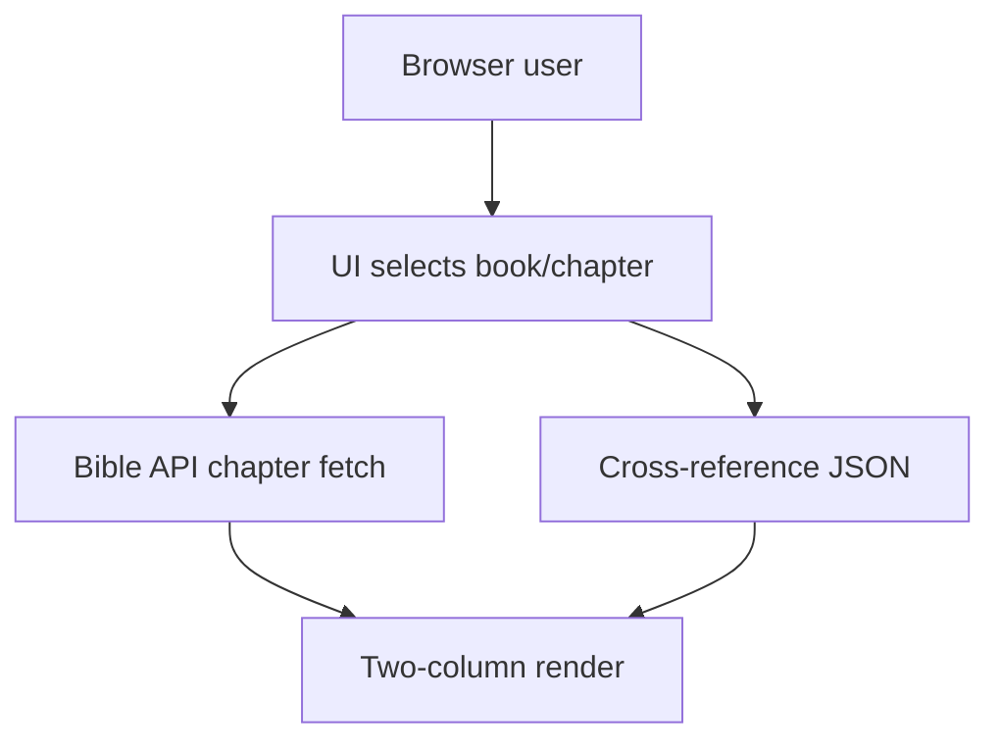
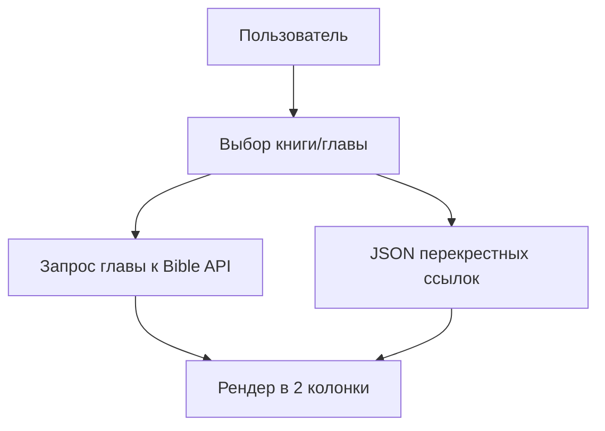

# BibleTask

## English
## Problem
Reading scripture with chapter navigation and cross references is inconvenient when content is split across multiple sources.
## Solution
BibleTask provides a lightweight web page that loads chapters from API and displays verse cross references in a readable format.
## Tech Stack
- HTML/CSS/JavaScript
- External Bible API
- Cross-reference JSON dataset
## Architecture
```text
index.html
app.js
styles.css
config.js
arrayBooks.js
```

## Features
- Book/chapter selectors
- API-based chapter loading
- Two-column scripture layout
- Verse cross-reference panel
## How to Run
Open `index.html` in browser (internet access required for API calls).

## Русский
## Проблема
Чтение Писания с навигацией по главам и перекрестными ссылками неудобно, когда данные приходят из разных источников.
## Решение
BibleTask — легковесная веб-страница, которая загружает главы через API и показывает перекрестные ссылки в удобном виде.
## Стек
- HTML/CSS/JavaScript
- Внешний Bible API
- JSON-датасет перекрестных ссылок
## Архитектура
```text
index.html
app.js
styles.css
config.js
arrayBooks.js
```

## Возможности
- Выбор книги и главы
- Загрузка текста главы по API
- Двухколоночный вывод текста
- Блок перекрестных ссылок
## Как запустить
Откройте `index.html` в браузере (нужен интернет для API-запросов).
